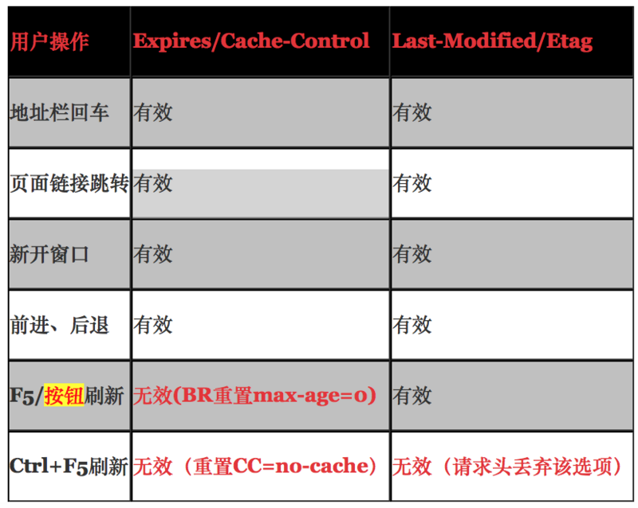
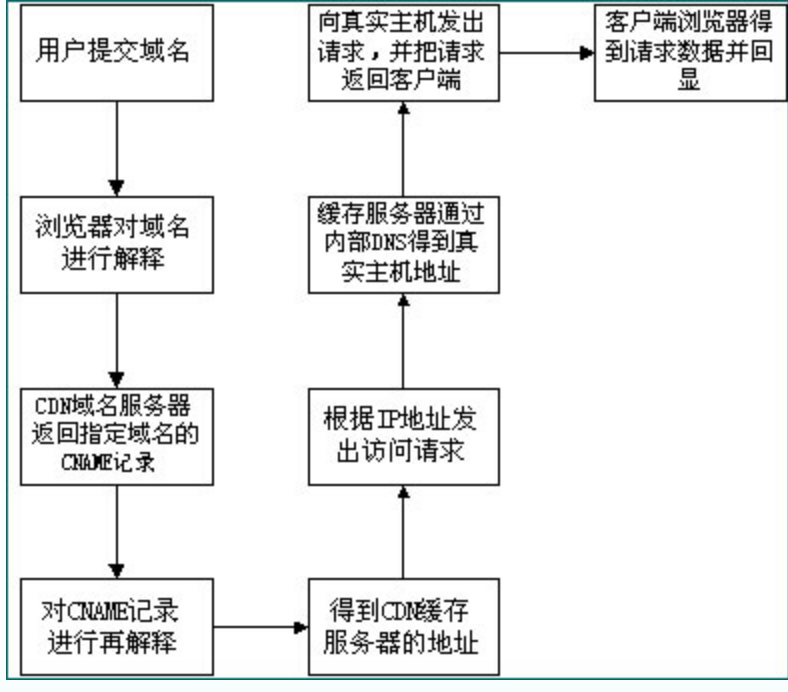

真正的性能优化，缓存是效率最高的一种，缩减时间也是最大的；

缓存可以从以下几个方面来描述：
    DNS缓存：
    CDN部署和缓存：
    http缓存：
   由于浏览器会在cns解析步骤中消耗一定时间，对于一些高访问量网站来说；做好dns的缓存工作就会一定程度上提高网站效率；cdn缓存作为静态资源文件的分发网络，本身就已经提升了，网站静态资源的获取速度，加快网站的加载速度，同时给静态资源做好缓存工作，有效的利用已缓存的静态资源，加快获取速度；http魂村，也就是给资源设定缓存时间，防止在有效的缓存时间内对资源进行重复下载，从而提升整体网页的加载速度；

移动端优化： 使用长cache，减少重定向，首屏优化，保证首屏加载数据小于14kb；不滥用web字体；


缓存分类： 分为服务端和 客户端缓存，常用的服务端缓存有cdn缓存，客户端缓存就是指浏览器缓存；
浏览器缓存： 分为强缓存和协商缓存；
    1.强缓存指 浏览器在加载资源是，先根据这个资源的一些http header判断他是否命中强缓存，强缓存加入命中，浏览器直接从自己的缓存中读取资源，不会发到服务器；
    2 协商缓存： 当强缓存没有命中的时候，浏览器一定会发送一个请求到服务器，通过服务器端依据缓存资源的另外一些http header验证这个资源是否命中协议缓存。如果协商缓存命中，服务器会将这个请求304 ，但是不会返回这个资源的数据，而是告诉客户端可以直接从缓存中加载这个资源，于是浏览器就会从自己的缓存中加载这个资源，如果没有命中，就会将资源返回客户端，并更新本地缓存数据；
强缓存和协商缓存区别：强缓存不发请求到服务器，协商缓存会发请求到服务器；

## 如何设置缓存：
Html meta标签控制缓存（非http协议定义）；
```
<META HTTP-EQUIV="Pragma" CONTENT="no-cache”> ：
```
 上述代码的作用是告诉浏览器当前页面不被缓存，每次访问都要去服务器拉去。这种方法使用上很简单，但是只有部分浏览器支持，而且所有缓存代理服务器都不支持，因为代理不解析html内容并本身？ 缓存代理服务器：就是存放频繁访问内容的服务器；

http头信息控制缓存： http头信息控制缓存是通过expires ，cache-control （强缓存），last-modified/if-modified-since  ,Etag /if-none-match  （协商缓存）实现；
expire 是http1.0提出的一个表示自愿过期时间的一个header，他描述是一个绝对时间，由服务器返回，用GMT格式的字符串表示；
读取缓存数据的条件： 缓存过期时间（服务器的） 《  当前时间（客户端）
缺点：expire是较老的强缓存管理header，由于他是服务器返回的一个绝对时间，这样存在一个问题，如果客户端的时间和服务器的时间相差很大，那么误差就很大了，所以从http1.1 版本开始，使用cache-control：max-age 来代替；

Cache-Control 描述的是一个相对时间，在进行缓存命中的时候，都是利用客户端时间进行判断，所以相比较expire，cache-control的缓存管理更有效，更安全一些；
读取缓存数据的条件： 上次缓存时间 + max-age  < 当前时间；
cache-control的值可以使public private，no-cache,no-store,no-transform,must-revalidate,proxy-revalidate,max-age 
Public指示响应可被任何缓存区缓存。
Private指示对于单个用户的整个或部分响应消息，不能被共享缓存处理。这允许服务器仅仅描述当前用户的部分响应消息，此响应消息对于其他用户的请求无效。
no-cache指示请求或响应消息不能缓存，该选项并不是说可以设置”不缓存“，而是需要和服务器确认
no-store在请求消息中发送将使得请求和响应消息都不使用缓存，完全不存下來。
max-age指示客户机可以接收生存期不大于指定时间（以秒为单位）的响应。上次缓存时间（客户端的）+max-age（64200s）<客户端当前时间
min-fresh指示客户机可以接收响应时间小于当前时间加上指定时间的响应。
max-stale指示客户机可以接收超出超时期间的响应消息。如果指定max-stale消息的值，那么客户机可以接收超出超时期指定值之内的响应消息。
header可以只启用一个，也可以同时启用： 当response header中，expire 和 cache-control 同时存在，cache-control优先级高于expires；
3 last-modified /if-modified-since : 要配合cache-control使用： 
last-modified ： 标识这个相应资源的最后修改时间，web服务器在响应请求时，告诉浏览器资源的最后修改时间；
If-modified-since: 当资源过期时（强缓存失效），发现资源具有last-modified声明，则再次向web服务器请求时带上if-modified-since，表示请求时间，web服务器收到请求后，发现有头if-modified-since则与被请求资源的最后修改时间进行对比；若最后修改时间较新，说明资源又被修改过，则响应正片资源内容，http200；若最后修改时间较旧，说明资源无新修改，则相应http304，告知浏览器继续使用所保存的cache；
缺点：  last-modified 标注的最后修改时间只能精确到秒级，如果某些文件在1秒钟以内，被修改多次的话，他将不会准确标识文件的修改时间；如果某个文件会被顶起生产，当有时内容并没有任何变化，但是last-modified却改变，导致文件无法使用缓存，有可能存在服务器没有准确获取文件修改时间，或者与代理服务器时间不一致等情形了
4 etag/if-none-match ： 也要配合cache-control使用：
etag： web服务器响应请求时，告诉浏览器当前资源在服务器的唯一标识（生成规则由服务器决定）；apache中，etage的值，默认是对文件索引节，大小，和最后修改时间进行hash得到；
if-none-match ： 当资源过期时，发现资源具有etag声明，则再次向服务器请求时带上头if-none-match(etag的值)，web服务器收到请求后发现有头if-none-match 则与被请求资源的相应校验串进行对比，决定返回200 或 304;
Etag是服务器自动生成或者由开发者生成的对应资源在服务器端的唯一标识符，能够更准确的控制缓存，last-modified和etag 一起使用时，服务器会有限校验etag；
浏览器第一次请求流程图


浏览器再次请求时

用户行为与缓存：



## CDN缓存
cdn缓存属于cache服务器的一种，
Cdn的全称是content delivery network ；内容分发网络。 目的是通过现有的internet中增加一层新的网络架构，将网站的内存发送到最接近用户的网络边缘；使用户可以就近取得所需的内容，解决internet网络拥塞状况；提高用户访问网站的响应速度，从技术上解决由于网络带宽小，用户访问量大，网点分布不均等原因，解决用户访问网站的响应速度慢的根本原因；



通过上图，我们可以了解到。使用了cdn缓存后的网站的访问过程为：
1. 用户向浏览器提供要访问的域名；
2. 浏览器调用域名解析库对域名进行解析，由于cdn对域名解析过程进行调整，所以解析函数库一般得到的是该域名对应的cname记录，为了得到实际ip地址，浏览器需要再次对获取的cname域名进行解析以得到实际的ip地址，在此过程中，使用的全局负载均衡dns解析，如根绝地理位置信息解析对应的ip地址，是得用户能就近访问；
3. 此次解析得到cdn缓存服务器的ip地址，浏览器在得到实际的ip地址以后，向魂村服务器发出访问请求；
4. 若文件未修改，返回304；当前文件已过期，则缓存服务器根据浏览器提供的要访问的域名，通过cache内部专业dns解析得到此域名的实际ip地址，再次有魂村服务器向此实际ip地址提交访问地址
5. 缓存服务器从实际ip地址得到内容后，一方面在本地进行保存，以备以后使用，二方面把获取的数据返回给客户端，完成数据服务过程；
6. 客户端得到有服务器返回的数据以后显示出来并完成整个浏览的数据请求过程；
