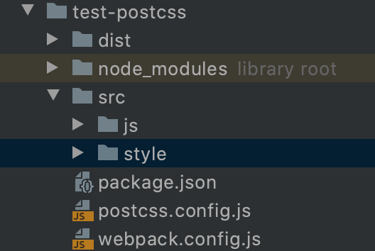
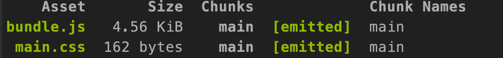
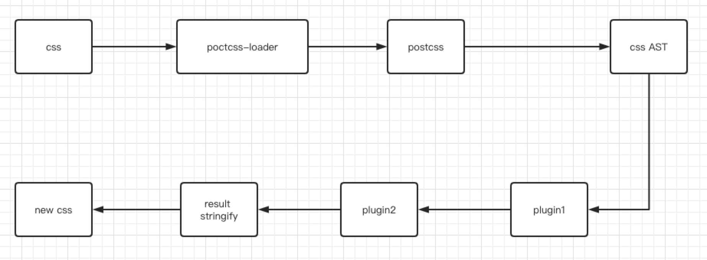

### 前言
说起前端，大家总不忘想起前端三大组成部分：html，js和css。但是在多数web开发工程师的眼里，css总是一段苦涩的记忆。

就像这张图中一样，在早期进行大型的项目开发中，错综复杂的css会让开发者崩溃的。
产生这些问题的原因来源于css本身，比如css的语法不够强大，没有嵌套层级，需要书写大量的重复性的选择器。再例如没有变量和合理的样式复用的机制，是的逻辑上相关的属性值必须以字面量的形式重复输出，导致难以维护。

为了解决这些问题，便诞生了css预处理器。
### css预处理器 
什么是css预处理器呢？

预处理器是基于css，在其上做了一层属于自己的DSL（Domain specific language），用来解决css遇到的问题。

css赋予了web工程师在css方面新的能力，本文以[Sass](https://www.sass.hk/)为例。
第一：完全兼容css3。在前端快速发展时候，也会有跟不上的，那就是浏览器的更新速度，浏览器的厂商太多，不同的厂商对css标准的解析效果不同，进而对新的特性许多新的特性无法直接在当前浏览器中使用，使得css在不同浏览器中兼容就带来了很大的问题。但是在sass中可以放心的使用css3的新特性。

第二，扩展了css的功能:增加了变量，嵌套，混合等功能。长期以来，css被人诟病的一个问题就是没有逻辑处理。增加了逻辑处理可以让代码复用性更强。解决了原本css的语法不够强大的问题。
最容易上手的就是嵌套和变量了。
```
// sass 
$red_color: #ea7142;
$green_color:#299e22;
#hello_sass{
    color: $red_color;
    .font_green_color{
        color: $green_color;
    }
}
===>
#hello_sass{
    color: #ea7142;
}
#hello_sass .font_green_color{
    color: #299e22;
}
```
css预处理器的代码是无法直接运行于浏览器的，所以我们还需要进行编译解析成为css文件。这个过程中，我们就可以添加很多的构建环节，比如代码的检查，压缩，排序等等。

这就是本文的重点，postCss
### postCss


postCss是一个使用js插件来转换样式的工具，postcss的插件会检查你的css。

其中最常用的插件莫过于autoprefixer这个插件了，这个插件会添加vendor浏览器的前缀，让我们不需要为了兼容而不断的写-webkit-这样无聊的代码，丢掉了历史包袱。
那你可能会有疑问了，为什么我创建的vue项目也不需要写前缀啊？原来是vue-cli在项目创建的时候已经默认配置了autoprefixer这个插件了。
在postcss中还有很多amazing的插件，比如可以自动转换px来进行不用屏幕不同宽度大小的适配的postcss-px-to-viewport，还有强迫症的福音，可以自动对css属性依照设定的规则进行排序的Postcss-sorting等等。
当然，纸上得来终觉浅，我们来试用一下postcss
### 实践
构建一个js项目。
```
mkdir test-poctcss
npm init 
npm install --save-dev css-loader style-loader webpack webpack-cli mini-css-extract-plugin
// 安装poctcss相关依赖 
npm install --save-dev postcss postcss-loader 
```
初始化项目，使用webpack来进行项目的打包。创建目录结构

我们使用postcss.config.js来对poctcss进行配置。现在我们仅仅以autoprefixer为例子。
```
npm install --save-dev autoprefixer

// postcss.config.js
module.exports = {
  plugins: [
    require('autoprefixer')
  ]
}

```
这样，我们就成功的将插件插入了poctcss这个方法中。接下来就是让webpack认识poctcss了。在安装poctcss的时候我们还引入了poctcss-loader这个包，我们将打包css相关的内容时候，先调用postcss-loader。
```
// webpack.config.js
const path = require('path');
const MiniCssExtractPlugin = require('mini-css-extract-plugin')
module.exports = {
  entry: './src/js/index.js',
  output: {
    filename:'bundle.js',
    path:path.resolve(__dirname,'dist')
  },
  module: {
    rules:[
      {
        test: /\.css$/,
        use:
          [{
            loader: MiniCssExtractPlugin.loader
          },
            'css-loader', 'postcss-loader' ]

      },
    ]
  },
  plugins: [
    new MiniCssExtractPlugin({
      filename: 'main.css'
    })
  ]
}

// index.js
import '../style/index.css'
const div = document.createElement('div')
div.innerHTML = 'hello postcss'
div.className = 'hello_postcss'
document.body.append(div)

// index.css
.hello_postcss{
    color: #00DD00;
    display: flex;
}

```
配置好了webpack,js和css文件.我们使用webpack来打包
```
webpack --mode development
```

ok。已经成功打包了。让我们看看dist下面的css文件长什么样吧。
```
.hello_postcss{
    color: #00DD00;
    display: -webkit-box;
    display: -ms-flexbox;
    display: flex;
}

```
可以看见poctss将我们css中的display：flex打包转换成了多条不同前缀的属性。看来poctcss成功起了作用。
### 原理
为什么poctcss能够完成这些功能呢？通过阅读分析源码，得知。
我们在构建项目的时候，通过webpack会把css文件的内容传送给postcss-loader，
postcss-loader会解析postcss.config中的插件，传输给postcss，postcss会解析传入的css，将其转换为一个AST，然后通过各种不同的插件来对这个AST进行操作，最终序列化新的css，最后将结果返回到postcss-loader，进行webpack下一个loader的操作。


### 总结
本文只是简单的使用了一下postcss，还有许多不同的使用方法。

postcss不是css预处理器的替代品，虽然可以替代。同时，它是一个插件工具，丰富的插件生态意味着能够覆盖绝大多数的场景和业务。最后，postcss优化了整个web开发流程，强化了css的健壮性。
