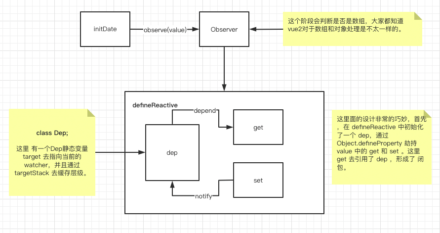
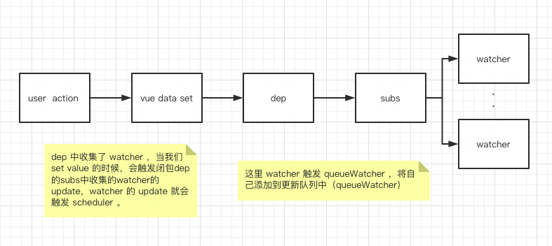

# vue 2.x 的响应式

老生常谈的问题，甚至有一些过时。

首先，先上图。

这个图大家都熟悉，vue官网上对于响应式的官方图解。

## 基础的概念普及

从图中我们可有看到，render - getter - collect dependency  - watcher ，我把这条线称为 依赖收集线 。还有setter - notify - watcher - re-render ，我称他为 相应渲染线。

咱们逐一分析：

### 依赖收集线。

前提： 所有data都已经被进行了响应式改造。

它的起点是 render。那么render做了什么呢？ 我们都知道vue是由template来承载html相关内容，那么 vue 将 template 转换成 ast 树 ，再转换成 VNode 树，在这个过程中，他会进行值的提取，就会走到了 watcher 收集依赖的过程。这样 页面的依赖情况就被 watcher 收集了 。

到这里 ， 依赖收集的内容就走完了。

### 响应渲染线

我们都知道 vue 是数据驱动框架，我们改变数据就可以影响页面呈现，这也是 响应渲染线要做的。

我们在代码中将 data 中的数据进行改变，就会触发 setter ，setter 会触发闭包中 dep 的notify功能，dep被收集在 watcher 中，就会触发 watcher 的 update 功能，进行页面的重新渲染，重新读取页面的值，改变 VNode。

## 流程

## 总结 

vue2.x 版本的双向绑定是基于 Object.defineProperty 来实现，通过在 data 值中添加闭包属性 dep ，并且劫持 get 方法，将所有读取当前属性的watcher，添加到属性的dep中。当用户触发 data 值的更新的时候，会通知 dep 中的所有 watcher 去更新。watcher 会将自己添加到更新队列中，然后执行自己的run方法，run 方法 就会触发，更新值且触发callback方法。